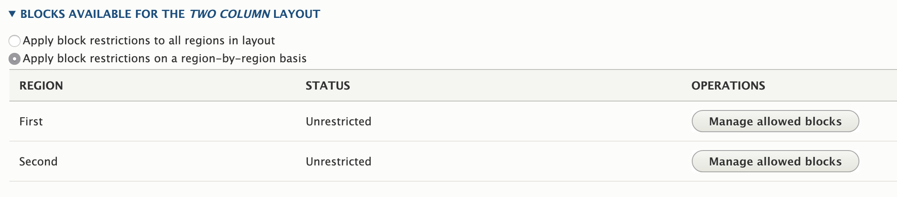
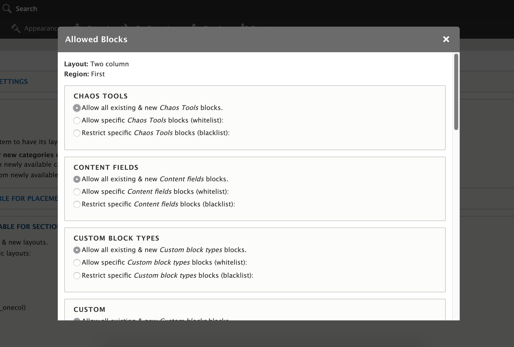

---
hide:
  - toc
---
# Restricting blocks to specific layouts & regions

For use cases which require that blocks may only be placed in specific layouts -- or in particular regions on those layouts -- sites may enable the `layout_builder_restrictions_by_region` submodule.

Once enabled, a new layer of restrictions are possible in the same "Manage Layout" interface for entities that use Layout Builder. A typical workflow of setting per-layout and per-region block restrictions is described below.

1. Under the "Layouts available for sections" area, re-select which layouts should be available on the entity to match which layouts you had specified before enabling the module.

2. For any of these layouts that should impose further block restrictions, first select whether these restrictions should apply to all regions in the layout or region-by-region:

3. If you have selected region-by-region, you will have a "Manage allowed blocks" button for each region. Use this interface to allow or deny blocks as you would with the global Layout Builder Restrictions setting:

1.  **Allow all existing & new blocks.** Self-explanatory. For example, if you choose this setting for custom blocks, any existing content block types (e.g., "Basic block") will be placeable, and any newly created content block types will be placeable.
2.  **Restrict all existing & new blocks.** No blocks from the indicated category will be available.
3.  **Allow specific blocks (allow-list).** When this is used, only explicitly selected blocks will be allowed. For example, if you whitelist the "Basic block," then subsequently add a new "Secondary block" custom block type, it will not be available until/unless you whitelist it as well.
4.  **Restrict specific blocks (deny-list).** When this is used, only explicitly selected blocks will be restricted. For example, if you deny-list the "Basic block," then subsequently add a new "Secondary block" custom block type, it will immediately be available, while the "Basic block" will continue to be restricted.

Once the per-layout restrictions have been saved, they will work in conjunction with any global block restrictions you have set for the entity. For example, if you restricted the "Basic block" globally, it will be restricted on all layouts, regardless of what further restrictions you may have set for a specific layout or region in a layout. In contrast, a block restriction that is specific to a given layout or layout region will _not_ affect other layouts or regions.
