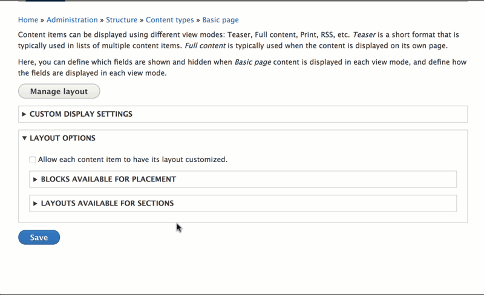

---
hide:
  - toc
---

# Introduction

> **Note:** Drupal core will soon provide a method for controlling available blocks in Layout Builder. See [Add visibility control conditions to blocks within Layout Builder](https://www.drupal.org/project/drupal/issues/2916876). This core solution should be sufficient for most site needs, so consider using that instead of Layout Builder Restrictions. For advanced use cases, Layout Builder Restrictions may still be useful.

## Problem/motivation

The default Layout Builder interface shows all blocks (including all entity-specific fields), and all layouts registered in the system. This poses a usability problem, as the list of blocks is quite long. Additionally, for many sites, the ability to curate which blocks and layouts are available on a given entity is an information architecture necessity.

## This module's solution

This module, Layout Builder Restrictions, provides a configurable UI for controlling which blocks and layouts are available for placement. Sites can allow all options from a certain provider, or restrict all options by provider, or specify individual allowed blocks & layouts.

