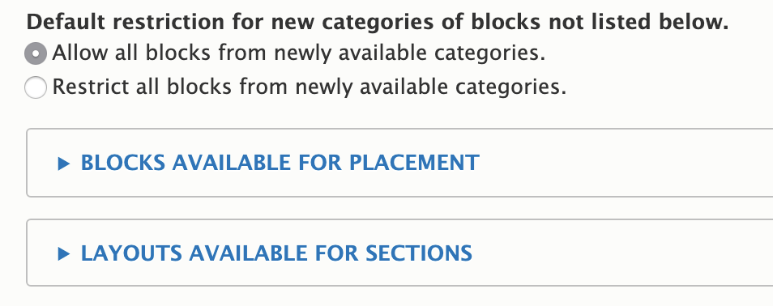
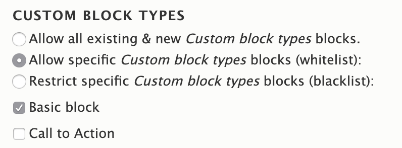

---
hide:
  - toc
---

# Quick Start

1. After enabling this module, go to any node content type's edit page (e.g., `/admin/structure/types/manage/{{content-type}}/display`).
2. Expand the "Layout options" fieldset and choose either "Blocks available for placement" or "Layouts available for placement". Initially, all blocks and layouts are available, as would be the case if the module were not enabled. For blocks, each "provider" is listed, and can be configured by these categories.

## Setting: Default restriction for new categories of blocks

This setting comes into play when you enable new functionality that provides a new category of blocks. For example, let's say your existing site does not have the core "Help" module enabled. When you enable the "Help" module (which provides a help block), do you want this block to be available in Layout Builder's available block, or do you want to opt-in to it?

Choosing "Allow all blocks from newly available categories" would make the "Help" block immediately available on the entity.

Choosing "Restrict all blocks from newly available categories" would suppress the "Help" block until you explicitly allowed it (see below).

## Setting: Blocks available for placement

Each category of blocks allows for 3 restrictions behaviors:

1.  **Allow all existing & new blocks.** Self-explanatory. For example, if you choose this setting for custom blocks, any existing content block types (e.g., "Basic block") will be placeable, and any newly created content block types will be placeable.
2.  **Allow specific blocks.** When this is used, only explicitly selected blocks will be allowed.
    1.  If you allow the "Basic block," then subsequently add a new "Secondary block" custom block type, it will not be available until/unless you allow it as well.
    2.  If you select "Allow specific blocks" and leave all blocks unchecked, you will effectively restrict all existing & new blocks
3.  **Restrict specific blocks.** When this is used, only explicitly selected blocks will be restricted.
    1.  If you restrict the "Basic block," then subsequently add a new "Secondary block" custom block type, it will immediately be available, while the "Basic block" will continue to be restricted.
